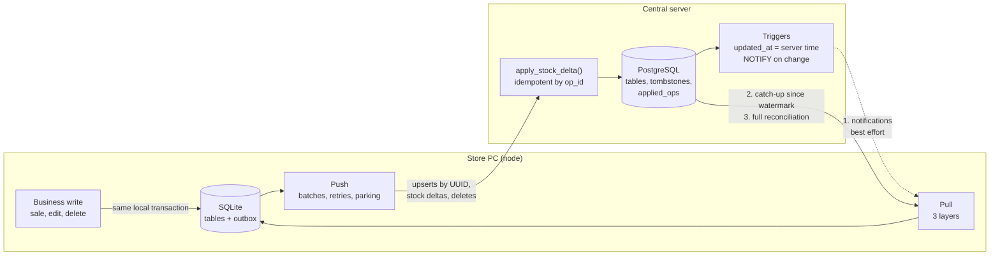
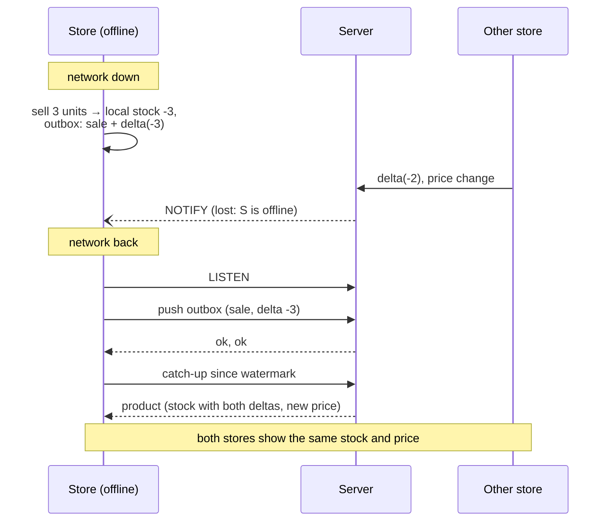

# pos-offline-sync

**Offline-first sync engine: point-of-sale nodes on local SQLite that keep selling without a network and converge with a central PostgreSQL when they reconnect.**


> **About this repository: a lite version**
>
> This is a **lite, public version of BodegaPro**, a point-of-sale and inventory system for small stores in Colombia. BodegaPro is a **private production system** that has been in development since **April 2026**.
>
> The production system is much broader: a desktop app and a web app with a full interface, business modules, licensing and multi-PC setups. It is developed together with my partners and is **private**.
>
> Only the **data synchronization core** was extracted for this repository: the offline-first sync, reimplemented cleanly with the same design. It has no business logic, no credentials and no customer data, and none of its code is copied from the private codebase.
>
> It was built **with AI assistance (Claude)**. The architecture and the design decisions come from the real system.

---

## The problem

A store's register cannot stop selling because the internet dropped, and in many neighborhood stores the connection drops often. So every PC keeps its own database and works fully offline. That creates the hard part: several PCs sell the **same product at the same time**, some of them offline for minutes or hours, and when they reconnect everyone must agree on the stock, without losing a single sale and without counting one twice.

## Architecture



Each node is a store PC with its own SQLite file. The server is the meeting point: nodes never talk to each other.

### Upload (push)

1. Every business change (a sale, an edit, a delete) is written to the local tables **and** to the `outbox` table in the same SQLite transaction.
2. The engine sends the outbox oldest first, in **batches**. The server applies each item in its own savepoint and returns one result per item, so one bad item does not fail the batch.
3. Results:
   - **Accepted** → `synced`.
   - **Rejected by the server** (a data error) → the item counts an attempt and is retried on the next cycle. After `max_attempts` it is **parked**: kept for audit and manual retry, but no longer retried, so it stops blocking the queue.
   - **Network error** (offline, or the reply was lost) → nothing changes and **no attempt is counted**. The item is fine; the network is not.

### Download (pull), in three layers

| Layer | When | What it does | Guarantee |
|---|---|---|---|
| 1. Notifications | Continuously while online | PostgreSQL `NOTIFY` says "table X, row Y changed"; the node reads that row | Fast, but **best effort**: anything sent while the node was offline is lost |
| 2. Catch-up | On reconnect and periodically | Reads every row changed since the table's **watermark** (a server timestamp), with keyset pagination | Recovers everything the notifications missed |
| 3. Reconciliation | First start, and on demand | Compares the full server state with the local state | Heals anything the other layers missed, including uploads that were lost |

When it reconnects, a node **subscribes first and then catches up**, so no change can fall in the gap between the two. Every catch-up and reconciliation **pushes first**: the server then already includes the node's own changes.



## Design decisions

### Stock travels as deltas, not values
A sale sends "rice: −2", never "rice: 98". If two stores sell from a stock of 100 at the same time and each sends its new value, the last one to arrive wins and one sale disappears (98 instead of 96). Deltas commute: the server adds them in whatever order they arrive and the total is always right.

Corollaries:
- **Upserts never write `stock`.** Even a new product's initial stock is a delta, so there is only one path that changes stock.
- **Stock is not clamped at zero.** `max(0, stock + delta)` would make the order of the deltas matter again and break convergence. An oversell is a business fact to surface, not to hide.
- **Quantities are integers** (grams for products sold by weight), so the sums are exact on both SQLite and PostgreSQL.

### Deltas are idempotent too
A delta is not naturally idempotent: applying "−2" twice is wrong. Each outbox operation carries a UUID (`op_id`), and `apply_stock_delta()` records it in `applied_ops` **in the same transaction** that changes the stock. If the server commits but the reply is lost, the node retries and the server answers `duplicate`. The demo injects exactly this fault.

### A transactional outbox instead of calling the server directly
Writing the change and its sync operation in one local transaction means a sale can never be saved without being queued, even if the app crashes a millisecond later. The queue also gives retries, ordering (a product's creation always travels before its first sale) and an audit trail of what was sent and what the server answered.

Upsert payloads are **read from the local row at send time**, not stored when the change is enqueued. Several edits to one row therefore coalesce into one operation, and that operation always carries the complete row.

### UUIDs everywhere, UUIDv5 for seed data
Every row gets a UUID when it is created, so offline nodes can create records without coordinating and every write is an **idempotent upsert by id**.

Data that every node ships with (a starter catalog) uses **UUIDv5** of the table and a natural key. Three stores seeding "RICE-1KG" produce the same id, so the server ends up with one product. The seed's initial stock is a delta whose `op_id` is also a UUIDv5, so it is applied once, not three times.

### Three download layers, because each one can fail differently
- **Notifications** are cheap and immediate, but a push channel does not replay what a disconnected client missed.
- **Catch-up** fixes that, but only for rows that still exist and that are newer than the watermark.
- **Reconciliation** is expensive, but it has no blind spots, and it is the only layer that can find a local row whose upload was lost.

Each layer covers the previous one's gap, and applying a row is idempotent, so overlapping between layers is safe.

### Watermarks use server time, with an overlap and a keyset cursor
- `updated_at` is set by a server trigger (`clock_timestamp()`), and the watermark is always a value read from the server. **A PC with a wrong clock can never skip changes.**
- Catch-up re-reads `CATCHUP_OVERLAP` (2 s) behind the watermark. A transaction that started before the last catch-up but committed after it has an older `updated_at`; the overlap picks it up, and re-applying rows is harmless.
- Pagination uses a `(updated_at, id)` keyset cursor, so it cannot get stuck when many rows share one timestamp (there is a test for that exact case).

### Tombstones make deletes durable
A deleted row leaves nothing to find with "changed since". The server records every delete in `tombstones`, which has its own watermark. Tombstones are also what keeps reconciliation from **resurrecting** a row that a node still has a copy of.

### How conflicts are resolved
| Conflict | Rule |
|---|---|
| Concurrent sales of one product | No conflict: deltas add up |
| Two edits to the same field | The last write **to reach the server** wins, ordered by server time. A node never overwrites its own unsent edit with an incoming version: its edit reaches the server and wins there |
| Edit vs. delete | **Delete wins.** The server rejects upserts of tombstoned rows (`tombstoned`) and every node removes the row |
| Incoming stock while local sales are unsent | Local stock = server stock + the node's unconfirmed deltas, so an unsent sale is never lost |
| Creations | No conflict: UUIDs never collide |

## Running it

### Demo, with one command

```bash
docker compose run --rm demo
```

This starts PostgreSQL, builds the image and runs the scenario:
1. Three stores seed the same catalog.
2. They sell rice in parallel.
3. `south` goes offline for half of the run and keeps selling.
4. Meanwhile `north` discontinues a product (a delete) and `center` changes a price.
5. One server reply to `center` is deliberately lost.

It ends by checking that everything converged:

```text
== Result
               Rice stock  sales rows  pending  parked
   ---------------------------------------------------
   server             202         150
   north              202         150        0       0
   center             202         150        0       0
   south              202         150        0       0

   Rice sold: north=101, center=100, south=97 → total 298
   Expected Rice stock: 500 - 298 = 202

   [OK] server stock equals initial stock minus all sales
   [OK] every store has the server's stock
   [OK] every store has every sale
   [OK] the delete reached the store that was offline (tombstone)
   [OK] the price change reached every store
   [OK] nothing left in any outbox

Converged.
```

The command exits with code 1 if the stores do not converge.

### Locally (Python 3.12)

```bash
docker compose up -d db                  # PostgreSQL on localhost:5433
python -m venv .venv && source .venv/bin/activate   # Windows: .venv\Scripts\activate
pip install -e ".[dev]"
python -m possync.demo
pytest
```

Set `DATABASE_URL` to use another PostgreSQL instance.

### Tests

`pytest` runs the scenarios end to end against a real PostgreSQL (`docker compose run --rm tests` runs them in containers):

| Area | What is verified |
|---|---|
| Concurrent sales | 4 nodes selling the same product from parallel threads converge to the exact stock; an unsent local sale survives an incoming stock update |
| Offline node | A node sells offline, reconnects, uploads its queue and catches up; notifications missed offline arrive through catch-up |
| Tombstones | A delete reaches a node that was offline; reconciliation does not resurrect it; delete wins over an offline edit; sales of a deleted product are kept |
| Retries and parking | Data errors are retried once per cycle and parked after N attempts without blocking the queue; network errors never count; parked items can be retried |
| Idempotency | A lost reply does not apply a delta twice; a retried upsert does not touch the row again; seed products from N nodes converge to one row with the stock applied once |
| Reconciliation | Re-uploads a row whose upload was lost; restores rows damaged or missing locally |
| Watermarks | Catch-up pages through many rows sharing one timestamp; watermarks are server time |

CI (GitHub Actions) runs `ruff check`, `ruff format --check`, the test suite against a PostgreSQL service, and the demo.

## Project structure

```text
pos-offline-sync/
├── src/possync/
│   ├── node.py         # Local node: SQLite, business operations, transactional outbox
│   ├── sync.py         # Sync engine: push (batches, retries, parking) and the three pull layers
│   ├── server.py       # Server operations: batch apply, reads for each pull layer
│   ├── transport.py    # Link to the server with a network switch and fault injection
│   ├── ids.py          # UUIDv4 for runtime records, UUIDv5 for seed data
│   ├── demo.py         # The convergence demo
│   └── sql/
│       ├── server.sql  # PostgreSQL schema, triggers, apply_stock_delta()
│       └── node.sql    # SQLite schema, outbox, watermarks
├── tests/              # End-to-end scenarios (pytest)
├── docker-compose.yml  # PostgreSQL + demo + tests
└── .github/workflows/ci.yml
```

## Limitations

This is a focused reimplementation for study and discussion, not a product:

- **No authentication, tenants or TLS.** Nodes reach PostgreSQL directly, and `node_id` is self-declared. A real deployment puts an authenticated API in between.
- **Row-level last-writer-wins** for ordinary fields, ordered by server arrival: no field-level merge, vector clocks or CRDTs beyond the stock counter.
- **The overlap window is fixed** (2 s). A transaction slower than that, committing between two catch-ups, is only recovered by the next reconciliation.
- **Nothing is compacted.** `outbox`, `tombstones` and `applied_ops` grow forever. A real system needs retention, and `applied_ops` must outlive the longest time a node can stay offline.
- **Notifications need a persistent connection** (`LISTEN`). The demo's "network" is a switch that opens and closes PostgreSQL connections, and the nodes are threads in one process rather than separate machines.
- **The domain is minimal on purpose:** products and sales, nothing else.

## Author

**Martin Sanchez** ([@martinmsanchezm](https://github.com/martinmsanchezm))

## License

[MIT](LICENSE)
